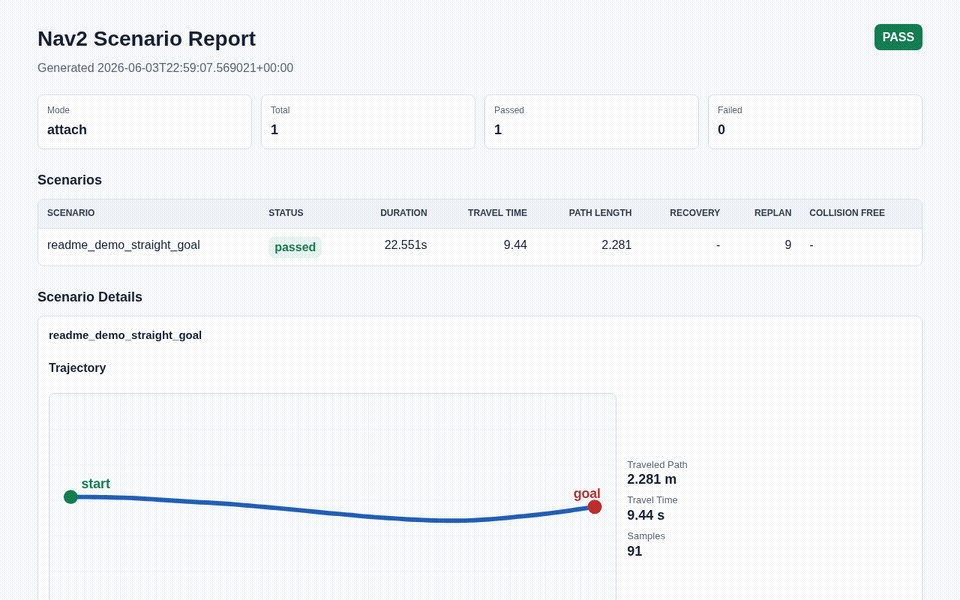

# nav2_scenario_runner

[](https://github.com/rsasaki0109/nav2_scenario_runner/actions/workflows/ci.yml)
[](https://github.com/rsasaki0109/nav2_scenario_runner/actions/workflows/pages.yml)
[](LICENSE)
[](pyproject.toml)

[](https://rsasaki0109.github.io/nav2_scenario_runner/#benchmark)
[](https://rsasaki0109.github.io/nav2_scenario_runner/#benchmark)
[](https://rsasaki0109.github.io/nav2_scenario_runner/#benchmark)
[](https://rsasaki0109.github.io/nav2_scenario_runner/#benchmark)

Scenario-as-Code test runner for Nav2. Run repeatable navigation regression tests in simulation and CI.

`nav2_scenario_runner` aims to bring a Playwright/Cypress-like developer experience to Nav2-based mobile robot development: write scenarios in YAML, run them from one CLI, collect Nav2-aware metrics, and publish CI-friendly reports.

Project site: <https://rsasaki0109.github.io/nav2_scenario_runner/>

<p align="center">
  
</p>

```bash
nav2_scenario_runner run examples/turtlebot3_gazebo/smoke.yaml
```

The README demo GIF is captured from a real Nav2/Gazebo run, including metrics and a generated `/odom` trajectory view, not a toy animation. See [docs/demo-capture.md](docs/demo-capture.md) for the Playwright recorder workflow and `scripts/record_nav2_foxglove_demo.sh`.

Current scaffold usage from a source checkout:

```bash
python3 -m pip install -e .
nav2_scenario_runner init .
nav2_scenario_runner doctor
nav2_scenario_runner lint examples/turtlebot3_gazebo/
nav2_scenario_runner run examples/turtlebot3_gazebo/ --tag smoke --dry-run --html-report index.html
nav2_scenario_runner report reports/results.json
nav2_scenario_runner compare reports/results.json --baseline reports/main.json
nav2_scenario_runner run examples/turtlebot3_gazebo/smoke.yaml --mode attach
nav2_scenario_runner run examples/turtlebot3_gazebo/smoke.yaml --mode gazebo-sim
nav2_scenario_runner run examples/turtlebot3_gazebo/smoke.yaml --mode gazebo-sim --wait-for-clock
nav2_scenario_runner run examples/turtlebot3_gazebo/smoke.yaml --mode gazebo-sim --reset-world
nav2_scenario_runner run examples/turtlebot3_gazebo/smoke.yaml --mode gazebo-sim --execute-nav2
```

Without installing:

```bash
PYTHONPATH=src python3 -m nav2_scenario_runner lint examples/turtlebot3_gazebo/
PYTHONPATH=src python3 -m nav2_scenario_runner run examples/turtlebot3_gazebo/ --tag smoke --dry-run
```

Create a starter project:

```bash
nav2_scenario_runner init .
nav2_scenario_runner lint scenarios/
nav2_scenario_runner run scenarios/ --dry-run
```

Generated files:

- `scenarios/smoke.yaml`
- `.github/workflows/nav2_scenario_tests.yaml`

`init` refuses to overwrite existing generated files unless `--force` is provided.

Check your environment:

```bash
nav2_scenario_runner doctor
nav2_scenario_runner doctor --check-ros
nav2_scenario_runner doctor --check-gazebo
nav2_scenario_runner doctor --check-ros-graph
nav2_scenario_runner doctor --json reports/doctor.json
```

`doctor` treats ROS 2/Nav2 modules as optional by default. `--check-ros` makes them required, which is useful before `--mode attach`. `--check-gazebo` requires the Gazebo Sim `gz` CLI, `ros2` CLI, and `ros_gz_bridge` package. `--check-ros-graph` verifies `ros2 node list` and `ros2 topic list`.

`--dry-run` validates, discovers, filters, and writes JSON and JUnit planning reports. `--mode attach` is the first ROS 2/Nav2 execution boundary and expects Nav2 to already be running.

Current execution modes:

- `--dry-run` or `--mode dry-run`: validate and produce a JSON planning report without ROS.
- `--mode attach`: connect to an existing ROS 2/Nav2 graph and execute the v0.1 built-in steps.
- `--mode gazebo-sim`: run a Gazebo Sim lifecycle smoke by launching `gz sim` for each scenario's `simulator.world`, optionally launching scenario stack processes, resetting the world, executing top-level simulator steps, waiting for `/clock`, executing Nav2 steps, then shutting everything down and saving logs.

Current `gazebo-sim` mode is a simulator lifecycle adapter skeleton. It validates Gazebo CLI/world startup, can launch `simulator.launch` and `nav2.bringup` with `--launch-scenario-stack`, can apply top-level `spawn_obstacle`, `move_entity`, and `delete_entity` steps with `--execute-simulator-steps`, can schedule top-level `parallel` simulator branches while Nav2 executes, can collect Gazebo contact topics with `--collect-contacts`, and can attach to an active Nav2 graph with `--execute-nav2`.
Gazebo Sim mode writes scenario bundles under `reports/artifacts/<scenario_id>/`.
Use `--skip-gazebo-preflight` only when the CI image or test harness has already validated `doctor --check-gazebo`.
Use `--launch-scenario-stack` to start scenario `simulator.launch` and `nav2.bringup` blocks with `ros2 launch`; their logs are saved in the scenario artifact bundle.
Use `--wait-for-ros-graph --ros-graph-timeout 10` to verify `ros2 node list` and `ros2 topic list` can inspect the launched ROS graph.
Use `--reset-world --world-reset-timeout 10` to reset the Gazebo world after startup and before readiness checks.
Use `--execute-simulator-steps --simulator-step-timeout 10` to apply top-level `spawn_obstacle`, `move_entity`, `delete_entity`, and `wait` steps before readiness checks. Combine it with `--execute-nav2` to run top-level `parallel` simulator branches during Nav2 execution.
Use `--collect-contacts --contact-topic /your/contact/topic` to monitor Gazebo contact topics and emit `collision_count` / `collision_free`.
Use `--wait-for-clock --clock-timeout 10` to verify simulation time is visible through ROS 2 before the simulator is torn down.
Use `--wait-for-nav2 --nav2-timeout 30` to verify the Nav2 `NavigateToPose` action server is available before executing scenario steps.
Use `--wait-for-navigation-data --navigation-data-timeout 30` to verify TF, map, and costmap topics are publishing before executing scenario steps.
Use `--execute-nav2` to run the same built-in Nav2 steps as attach mode while the Gazebo process is alive.
Trace reports preserve explicit Gazebo step offsets, so scheduled simulator branches appear in timeline order.
See [docs/gazebo-sim.md](docs/gazebo-sim.md) for the current lifecycle smoke behavior and artifacts.

Default reports:

- `reports/results.json`
- `reports/junit.xml`

`run` can also write human-facing summaries directly:

```bash
nav2_scenario_runner run scenarios/ \
  --report-dir reports/ \
  --trace-report trace.json \
  --markdown-report summary.md \
  --html-report index.html \
  --github-summary
```

Render a human-readable summary from a JSON run report:

```bash
nav2_scenario_runner report reports/results.json
nav2_scenario_runner report reports/results.json --format markdown --output reports/summary.md
nav2_scenario_runner report reports/results.json --format html --output reports/index.html
nav2_scenario_runner report reports/results.json --github-summary
```

`--github-summary` appends a Markdown summary to `$GITHUB_STEP_SUMMARY` in GitHub Actions. `--format html` writes a self-contained report suitable for CI artifact upload. `report` exits with `0` when it successfully renders the file. Add `--fail-on-failure` when a CI step should return non-zero if the JSON report contains failed scenarios.

Baseline comparison:

```bash
nav2_scenario_runner compare reports/current.json \
  --baseline reports/main.json \
  --max-increase-percent path_length_traveled=10 \
  --max-increase-percent travel_time=15 \
  --max-delta recovery_count=1 \
  --output reports/compare.json \
  --markdown-output reports/compare.md \
  --github-summary
```

The compare command always checks status regressions. Numeric metric rules are opt-in and read values from each scenario's `metrics` object, with top-level numeric fields such as `duration_seconds` also supported.

Multi-configuration evaluation (leaderboard dashboard):

```bash
nav2_scenario_runner evaluate \
  --entry navfn=reports/navfn/results.json \
  --entry smac=reports/smac/results.json \
  --entry teb=reports/teb/results.json \
  --html-output reports/evaluation.html \
  --markdown-output reports/evaluation.md \
  --json-output reports/evaluation.json \
  --github-summary
```

`evaluate` runs the same scenario suite under several Nav2 configurations and
ranks them into a single dashboard: a `0-100` composite score leaderboard,
per-metric comparison bars, and per-scenario trajectory overlays across every
configuration. It takes at least two `--entry LABEL=report.json` configurations,
normalizes each metric per scenario (with `--lower-is-better` / `--higher-is-better`
overrides), and ranks by pass rate, then composite score, then metric wins. See
[docs/evaluation.md](docs/evaluation.md).

Trend tracking over time (record runs, then visualize drift):

```bash
nav2_scenario_runner record reports/results.json \
  --history reports/history.jsonl \
  --label "$(git rev-parse --short HEAD)"

nav2_scenario_runner trend reports/history.jsonl \
  --html-output reports/trend.html \
  --markdown-output reports/trend.md \
  --json-output reports/trend.json \
  --github-summary
```

`record` appends each run to an append-only JSONL history store keyed by a label
(typically a commit SHA), keeping scalar metrics only. `trend` renders that
history as a dashboard: a suite pass-rate line and per-scenario metric line
charts, plus Markdown with direction-aware latest-vs-previous deltas. This lets
CI catch a slow navigation regression that no single run would fail. See
[docs/trend.md](docs/trend.md).

Animated trajectory replay over a map:

```bash
nav2_scenario_runner replay reports/results.json \
  --map maps/warehouse.yaml \
  --html-output reports/replay.html \
  --duration 5
```

`replay` renders each scenario's recorded `/odom` trajectory as an animated SVG:
the robot marker travels the path on a loop via SMIL `animateMotion` (no
JavaScript), and with `--map` the path is drawn over the real ROS occupancy grid
(P2/P5 PGM) instead of a blank grid. The PGM is re-encoded to an embedded PNG
with the standard library only, so the output is a single self-contained HTML
file. See [docs/replay.md](docs/replay.md).

Interactive benchmark explorer (a single self-contained HTML page):

```bash
nav2_scenario_runner viewer \
  --entry navfn=reports/navfn.json \
  --entry smac=reports/smac.json \
  --map maps/warehouse.yaml \
  --html-output reports/viewer.html
```

`viewer` embeds the benchmark data in the page and renders it with dependency-free
vanilla JS: toggle planner configs, switch scenarios, and scrub/play the robot
along every recorded trajectory over the real map, with a live best-cell metric
table. It opens from `file://` or GitHub Pages — great for sharing a clip. See
[docs/viewer.md](docs/viewer.md).

Live benchmark dashboards (interactive explorer, leaderboard, trend, replay) are published on the
[project site](https://rsasaki0109.github.io/nav2_scenario_runner/#benchmark),
generated by the runner itself from the
[example benchmark suite](examples/benchmark/) on every deploy. Reproduce them
locally with `bash scripts/build_dashboards.sh`.

Benchmark-as-a-comment on every pull request (reusable GitHub Action):

```yaml
# .github/workflows/benchmark.yml
permissions:
  contents: read
  pull-requests: write
jobs:
  benchmark:
    runs-on: ubuntu-latest
    steps:
      - uses: actions/checkout@v4
      - uses: rsasaki0109/nav2_scenario_runner@v1   # the bundled "Nav2 Benchmark" action
        id: bench
        with:
          entries: |
            navfn=reports/navfn.json
            smac=reports/smac.json
          history: reports/history.jsonl            # optional: adds a regression section
      - uses: actions/github-script@v7
        with:
          script: |
            const fs = require('fs');
            const marker = '<!-- nav2-scenario-runner:benchmark -->';
            const body = fs.readFileSync('${{ steps.bench.outputs.comment-file }}', 'utf8');
            const { owner, repo } = context.repo, n = context.issue.number;
            const { data } = await github.rest.issues.listComments({ owner, repo, issue_number: n });
            const hit = data.find(c => c.body?.includes(marker));
            hit ? await github.rest.issues.updateComment({ owner, repo, comment_id: hit.id, body })
                : await github.rest.issues.createComment({ owner, repo, issue_number: n, body });
```

The action ranks your Nav2 configs into a leaderboard and posts a single
**sticky** comment (🥇/🥈/🥉 medals, 0–100 score, pass rate) that updates in
place on each push. With `history:` set it flags per-metric regressions versus
the previous run. Outputs `comment-file`, `evaluation-file`, and `winner`. This
repo dogfoods it via [`.github/workflows/benchmark-pr.yml`](.github/workflows/benchmark-pr.yml).
You can also render the comment locally:

```bash
nav2_scenario_runner pr-comment \
  --evaluation reports/evaluation.json \
  --trend reports/trend.json \
  --dashboard-url https://example.com/benchmark \
  --output reports/comment.md
```

See [docs/pr-benchmark-bot.md](docs/pr-benchmark-bot.md).

Self-updating README badges (shields.io endpoints) and a public leaderboard:

```bash
nav2_scenario_runner badge \
  --evaluation reports/evaluation.json \
  --trend reports/trend.json \
  --kind score \
  --output docs/badge-score.json
```

`badge` emits shields [endpoint](https://shields.io/badges/endpoint-badge) JSON
(`winner`, `score`, `passrate`, `regressions`). The badges at the top of this
README point at JSON served from GitHub Pages, so they refresh themselves
whenever the benchmark is regenerated — no CI secret, no third-party service.

Anyone can join the **public leaderboard**: drop a Nav2 run report into
[`examples/benchmark/submissions/`](examples/benchmark/submissions/) via pull
request (or the [benchmark submission issue](.github/ISSUE_TEMPLATE/benchmark-submission.yml)).
`scripts/build_dashboards.sh` auto-includes every submission, so a merged entry
appears on the [live dashboard](https://rsasaki0109.github.io/nav2_scenario_runner/#benchmark)
on the next deploy.

Real Nav2 numbers from a reproducible container (Docker + Gazebo):

```bash
docker build -f docker/Dockerfile -t nav2-scenario-runner:jazzy-gazebo .
docker run --rm -v "$PWD/out:/out" nav2-scenario-runner:jazzy-gazebo \
  "bash docker/run_benchmark.sh /out"
```

The image pins ROS 2 Jazzy + Nav2 + Gazebo on Nav2's demo robot and runs the
[benchmark scenario suite](examples/benchmark/scenarios/) (`straight_line`,
`narrow_corridor`, `u_turn`) under the full `gazebo-sim` execution ladder. The
run report shares the benchmark schema, so it feeds `evaluate`/`trend`/`viewer`
directly. The [`Nav2 Real Benchmark`](.github/workflows/nav2-benchmark.yml)
workflow runs it weekly/on-demand and uploads the dashboards. See
[docs/nav2-benchmark-ci.md](docs/nav2-benchmark-ci.md).

`--mode attach` currently supports:

- `wait_for_nav2_active`
- `set_initial_pose`
- `send_goal`
- `expect_goal_reached`

The attach backend requires a sourced ROS 2/Nav2 environment with `rclpy`, `action_msgs`, `geometry_msgs`, and `nav2_msgs` available.

Current attach metrics:

- `travel_time`: seconds from accepted `send_goal` to successful `expect_goal_reached`
- `travel_time.<goal_name>`: per-goal travel time
- `path_length_traveled`: traveled path length integrated from backend telemetry
- `path_length_traveled.<goal_name>`: per-goal traveled path length
- `replanning_count`: global plan update count during goal execution
- `replanning_count.<goal_name>`: per-goal global plan update count
- `recovery_count`: recovery behavior count when the backend provides it
- `recovery_count.<goal_name>`: per-goal recovery behavior count when available
- `collision_count`: collision/contact count when the backend provides it
- `collision_count.<goal_name>`: per-goal collision/contact count when available
- `collision_free`: boolean derived from `collision_count == 0`
- `goal_reached`: boolean marker for successful goal completion

Current assertion evaluation:

- `collision_free`: passes when the `collision_free` metric is true
- `goal_reached`: passes when the `goal_reached` metric is true
- `travel_time`: supports `max`
- `path_length`: supports `max` against `path_length_traveled`
- `replanning_count`: supports `max`
- `recovery_count`: supports `max` when the metric is available
- `timeout`: supports `max` against scenario duration
- assertions whose metrics are unavailable are reported as `skipped`
- `severity: warning` records a warning without failing the scenario

The ROS attach backend integrates `path_length_traveled` from namespaced `/odom` and counts `replanning_count` from namespaced `/plan`.
It does not yet collect `recovery_count`, so recovery assertions are skipped in ROS attach mode until a reliable Nav2 recovery event source is added.
ROS attach mode does not collect `collision_count`; collision assertions require a simulator/contact backend and are skipped there unless another collector provides the metric.

```yaml
apiVersion: nav2.scenario/v1alpha1
kind: Scenario

metadata:
  name: straight_line_goal
  tags: [smoke, navigation]

robot:
  profile: turtlebot3_waffle
  initial_pose: {x: 0.0, y: 0.0, yaw: 0.0}

steps:
  - wait_for_nav2_active:
      timeout: 30
  - set_initial_pose:
      x: 0.0
      y: 0.0
      yaw: 0.0
  - send_goal:
      name: main_goal
      pose: {x: 10.0, y: 0.0, yaw: 0.0}
  - expect_goal_reached:
      goal: main_goal
      timeout: 60

assertions:
  - collision_free: {}
  - travel_time:
      max: 60.0
```

## Why This Exists

Nav2 users can already launch simulations, write ROS 2 integration tests, and run Nav2 system tests. What is still missing is a focused E2E scenario test runner for daily development:

- readable YAML scenarios that can be reviewed in pull requests
- deterministic execution in simulation and CI
- Nav2-specific assertions such as goal reached, recovery count, replanning count, and final pose tolerance
- quality metrics such as travel time, traveled path length, clearance, and path efficiency
- baseline regression checks for "this PR made navigation worse"
- JUnit, JSON, HTML, Markdown, GitHub summary, trace, log, and rosbag artifacts

The project is a test runner, not a simulator. Simulator-specific details belong behind adapters.

## Product Goals

- Time to first passing scenario: under 10 minutes
- Minimal useful scenario: about 10 lines
- GitHub Actions setup: under 30 lines
- Failure diagnosis: artifacts should support a first hypothesis in under 3 minutes
- Adapter authoring: a new simulator adapter skeleton should be possible in a day
- Core examples flake rate: below 1%

## Architecture

The core stays thin and the ecosystem becomes thick.

Core responsibilities:

- DSL parsing and schema validation
- scenario discovery, planning, filtering, and sharding
- execution lifecycle and event bus
- plugin registry and compatibility contracts
- metric aggregation and baseline comparison
- report generation and CLI UX

Non-core responsibilities:

- simulator-specific APIs
- robot model asset management
- all actor behaviors
- Nav2 internals
- full AV/ADAS scenario standardization

See [docs/master-architecture.md](docs/master-architecture.md) for the full architecture draft.

## Repository Map

```text
.github/
  workflows/
    ci.yml
docs/
  master-architecture.md
  scenario-dsl.md
  metrics.md
  evaluation.md
  trend.md
  replay.md
  viewer.md
  pr-benchmark-bot.md
  nav2-benchmark-ci.md
  simulator-adapters.md
  ci.md
  plugin-authoring.md
  robot-profiles.md
  adr/
schemas/
  nav2.scenario.v1alpha1.schema.json
examples/
  turtlebot3_gazebo/
```

## Roadmap

The intended path is:

1. v0.1: first green scenario
2. v0.2: CI-ready smoke testing
3. v0.3: metrics and regression core
4. v0.4: dynamic events and robot profiles
5. v0.5: multi-simulator foundation
6. v0.6: plugin SDK
7. v0.7: baseline and flake management
8. v0.8: scenario library and parameter matrix
9. v0.9: v1 release candidate
10. v1.0: stable DSL, runner, plugin API, report schema, and CI templates

See [ROADMAP.md](ROADMAP.md).

## Positioning

`nav2_scenario_runner` is intended to sit above existing ROS 2 and simulator tools:

```text
ROS 2 launch_testing        -> process/test orchestration primitives
Nav2 Simple Commander       -> Nav2 action/service convenience layer
Gazebo / Isaac / Webots     -> simulation execution backends
RMF plugins                 -> optional infrastructure event sources
nav2_scenario_runner        -> scenario DSL + execution + metrics + regression + report
```

## License

Apache-2.0. See [LICENSE](LICENSE).
